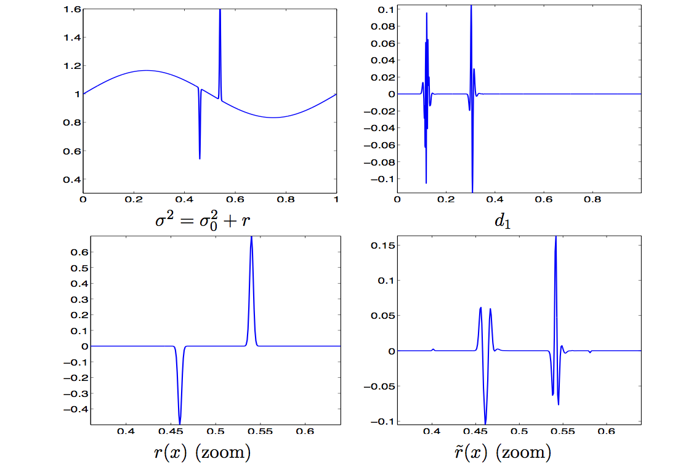

This Matlab package contains the source code to reproduce the figure of the article:

L. Demanet, G. Peyré. Compressive Wave Computation. Foundations of Computational Mathematics, 11(3), pp. 257–303, 2011.

- test_wave_1d.m: main script for 1D tests.
- test_wave_2d.m: main script for 2D tests.
- test_rtm: script for reverse time migration.

Copyright (c) 2010 Gabriel Peyré
